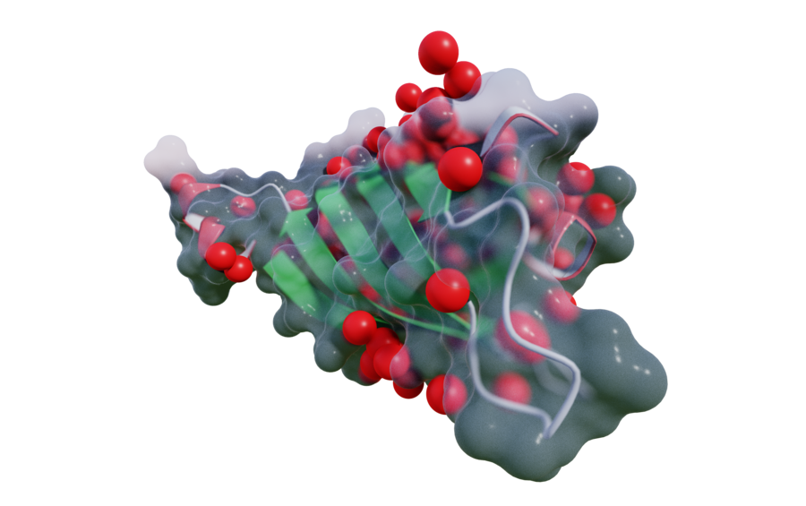

# Syntracer

A real-time, progressive path tracer for molecular visualization running entirely in the browser. Built on WebGL2 with CPU-side SAH BVH construction and GPU fragment-shader traversal.

**[Live Demo](https://syntopia.github.io/Syntracer/)**



Created by Mikael Hvidtfeldt Christensen, in close collaboration with Claude Code and OpenAI Codex.

---

## Features at a Glance

- Path tracing with importance-sampled environment and direct lighting
- PDB, SDF/MOL, and Gaussian CUBE file import
- Solvent-Exluded Surfaces (Molecular surface computed via GPU-accelerated distance-field evaluation)
- Seven molecular display styles including cartoon ribbons (with automatic DSSP detection)
- Four physically-based material models
- Analytic Preetham-Perez sky, uniform, and HDR environment lighting
- Volumetric rendering and isosurface extraction
- Progressive accumulation with configurable quality and tone mapping
- Real-time camera navigation with PCA-based molecular alignment
- Materials: Cook-Torrance microfacet BRDF with GGX distribution, Oren-Nayar diffuse, Glass (Dielectric Fresnel model), Translucent plastic

---

## Camera Controls

### Mouse

| Action | Effect |
|--------|--------|
| Left drag | Orbit — rotate around target. Yaw rotates around the camera's local up axis; pitch around the local right axis. |
| Right drag / Shift + left drag | Pan camera target in the image plane |
| Ctrl + left drag | Dolly zoom |
| Scroll wheel | Zoom (distance clamped to 0.1x -- 20x scene scale) |

### Keyboard

| Key | Action |
|-----|--------|
| **W / A / S / D** | Move camera target forward / left / backward / right in camera space |
| **Q / E** | Roll camera counter-clockwise / clockwise around the view direction |
| **Z** | Level the camera so the z = 0 ground plane appears horizontal |
| **F** | Set depth-of-field focus distance to the surface under the mouse cursor |
| **C** | Center the orbit target on the object under the mouse cursor |
| **1** | Align camera to PCA axis 3 of the hovered object (view along the axis of smallest variance — the "flat" face) |
| **2** | Align camera to PCA axis 2 (medium variance) |
| **3** | Align camera to PCA axis 1 (largest variance — the "thin" edge) |

PCA alignment gathers all atom positions from the hovered scene-graph object, computes the covariance matrix, extracts eigenvectors via power iteration with deflation, and orients the camera so the chosen principal axis points along the view direction.

---

## Rendering Pipeline

### Path Tracing

Monte Carlo path tracing runs in a WebGL2 fragment shader. Each frame traces one or more samples per pixel (configurable 1 -- 8) and accumulates into a floating-point texture. The display pass reads the accumulation buffer and applies tone mapping and exposure.

- **Max bounces**: 0 -- 6
- **Russian roulette**: starts at bounce 1 to limit path length without bias
- **Multiple importance sampling**: combines environment-map sampling with BSDF sampling using balance heuristic weights

### Acceleration Structure

A **Surface-Area-Heuristic (SAH) BVH** is built on the CPU over a unified primitive set (spheres, cylinders, triangles). The flattened BVH is packed into a 2D texture (4 vec4 per node) for GPU traversal with stackless early-termination.

---

## Running Locally

Serve the project with any static file server. For example, with uvicorn:

```bash
mamba run -n wave uvicorn server:app --reload
```

Then open `http://localhost:8000`.

### Downloading HDR Environment Maps

```bash
python tools/download_envs.py
```

This fetches 1k-resolution HDRI files from Polyhaven into `assets/env/`.

### Running Tests

```bash
npm test
```

or

```bash
mamba run -n wave node --test
```

---

## Architecture

```
src/
  main.js                  Application entry, UI, camera, render loop
  webgl.js                 WebGL2 init, shader compilation, uniforms, fragment shader
  molecular.js             PDB / SDF / CUBE parsers, bond generation
  scene_graph.js           Scene graph data model
  scene_graph_compile.js   Scene graph to geometry compilation
  representation_builder.js  Geometry builders for each display style
  bvh.js                   SAH BVH construction and flattening
  ray_pick.js              CPU ray-primitive intersection for picking
  camera_orbit.js          Quaternion orbit camera math
  surface_webgl.js         GPU distance-field SES computation + marching cubes
  cartoon.js               Cartoon ribbon geometry, H-bond detection
  volume.js                Volume grid processing, isosurface extraction
  analytic_sky.js          Preetham-Perez sky model
  hdr.js                   HDR / RGBE parsing, importance-sampling CDF
  input_controller.js      Pointer state, canvas-to-ray conversion
index.html                 UI layout, slider components, tab system
tools/
  download_envs.py         HDR environment map downloader
```
